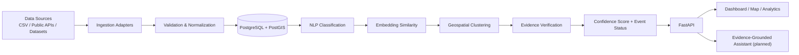
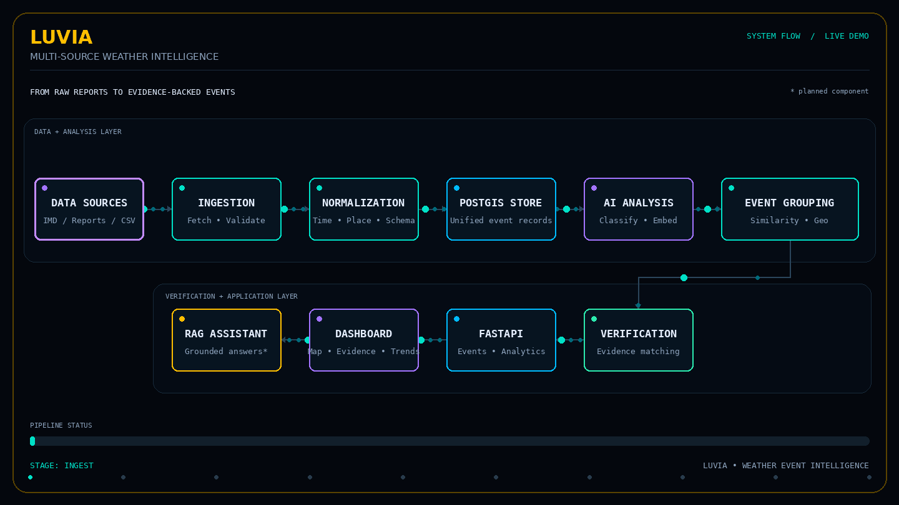

# LUVIA — Multi-Source Weather Intelligence

> From fragmented weather reports to evidence-backed weather-event intelligence.

LUVIA is a weather intelligence and verification platform designed to combine public incident reports with meteorological observations, identify related reports, group them into geospatial events, and assess how strongly each event is supported by independent evidence.

Weather information can arrive from weather stations, reanalysis datasets, public reports, and incident posts. These sources differ in format, timing, location precision, and reliability. LUVIA aims to bring these inputs into a unified pipeline so that analysts can inspect weather events alongside their supporting evidence.

## Why LUVIA?

Traditional weather views are useful for forecasts and observations, but public incident reports can add context about what people are experiencing on the ground. Those reports may also be noisy, duplicated, vague, or unverified.

LUVIA focuses on connecting the two: **public reports + meteorological context + transparent verification**.

## Core workflow

1. **Ingest** — load weather observations and public incident reports from supported datasets, APIs, or adapters.
2. **Normalize** — validate fields and standardize timestamps, event labels, and location information.
3. **Classify** — identify weather-related reports and categorize events such as heavy rainfall, flooding, storms, or strong winds.
4. **Find related reports** — use text embeddings and similarity measures to identify duplicates or semantically related reports.
5. **Cluster geographically** — group related reports by spatial proximity to build localized event clusters.
6. **Verify with evidence** — compare event reports against available meteorological context and calculate an explainable confidence score.
7. **Explore and explain** — expose structured events through APIs and, as the application layer develops, an interactive dashboard and evidence-grounded assistant.

## Architecture



The diagram represents the intended end-to-end system. Individual components may be at different stages of implementation; see **Project status** below.

### Animated architecture demo




## Technology stack

| Area | Technologies |
|---|---|
| Language and data processing | Python, Pandas |
| API backend | FastAPI, Uvicorn |
| Database | PostgreSQL, PostGIS |
| Ingestion | CSV adapter, mock/synthetic data, additional adapters as developed |
| NLP and similarity | Sentence Transformers, embeddings, cosine similarity |
| Geospatial analysis | PostGIS and geospatial clustering components |
| Development workflow | VS Code, Git, GitHub, `uv` |

The project synopsis also proposes meteorological sources such as IMD AWS observations and an ERA5 subset, a Streamlit/Plotly map dashboard, and a retrieval-augmented generation (RAG) assistant. Availability and integration of each external source depend on access, data licensing, and implementation progress.

## Project status

LUVIA is being developed incrementally. The repository should be treated as a work in progress, not a claim that every planned feature is production-ready.

- [x] Project environment and backend foundation
- [x] PostgreSQL/PostGIS connection and event storage
- [x] Initial FastAPI endpoint and API testing workflow
- [x] CSV ingestion adapter and synthetic/mock event data
- [x] Initial event classification and text-similarity pipeline work
- [ ] Complete live-source ingestion and scheduled refresh
- [ ] End-to-end evidence fusion and calibrated confidence scoring
- [ ] Full geospatial event clustering and map interface
- [ ] Five-agent workflow integration
- [ ] RAG assistant with evidence-grounded responses
- [ ] End-to-end tests, deployment, and documentation polish

Check the current code and issues for the exact implementation status of each module.

## Repository structure

The precise structure may evolve as modules are integrated. A typical layout is:

```text
LUVIA/
├── app/
│   ├── main.py
│   ├── api/
│   ├── ingestion/
│   ├── processing/
│   ├── verification/
│   └── agents/
├── data/
│   ├── mock/
│   ├── raw/
│   └── processed/
├── tests/
├── .env.example
├── .gitignore
├── pyproject.toml
└── README.md
```

Use the actual folder and module names in the repository if they differ from this illustrative layout.

## Getting started

### Prerequisites

- Python version supported by the repository dependencies
- PostgreSQL with PostGIS enabled
- `uv` package manager, if the project is configured to use it
- Git

### 1. Clone the repository

```bash
git clone <YOUR_GITHUB_REPOSITORY_URL>
cd <YOUR_REPOSITORY_FOLDER>
```

### 2. Install dependencies

If the repository contains `pyproject.toml` and `uv.lock`:

```bash
uv sync
```

Otherwise, follow the dependency installation method defined in the repository.

### 3. Configure environment variables

Create a local `.env` file using the project's `.env.example` as a guide. Configure the database connection string and any source/API credentials required by the modules you intend to run.

**Do not commit `.env` files, credentials, API keys, or private connection strings.**

### 4. Prepare the database

Create a PostgreSQL database and enable PostGIS if required by the schema:

```sql
CREATE EXTENSION IF NOT EXISTS postgis;
```

Run the schema/migration scripts provided in the repository, if present. Table names and setup commands should follow the current project code.

### 5. Run the API

Use the entry point and import path present in the repository. For example, if the application is exposed as `app.main:app`:

```bash
uv run uvicorn app.main:app --reload
```

Open `http://127.0.0.1:8000/docs` to explore the interactive API documentation.

> The command above is an example. Adjust the import path if the actual `main.py` location differs.

## Data sources and responsible use

LUVIA is designed to support multiple sources, including public weather observations, historical reanalysis data, downloadable datasets, and public incident reports. Not every source is necessarily connected in every development environment.

- Preserve source provenance and original records where practical.
- Validate timestamps, coordinates, and required fields before analysis.
- Treat text-extracted locations as uncertain until corroborated.
- Distinguish reported incidents from independently supported observations.
- Treat confidence scores as evidence-strength indicators, not guarantees of truth.
- Respect source terms, rate limits, privacy, and applicable data-use policies.

## Planned intelligent components

The project synopsis describes five task-specific agents:

| Agent | Intended responsibility |
|---|---|
| Data Agent | Collect, validate, standardize, and deduplicate incoming records |
| Analysis Agent | Classify reports and extract event type, place, and time |
| Verification Agent | Compare reports with meteorological context and supporting evidence |
| Geospatial Agent | Group related reports and manage localized event areas |
| RAG Agent | Retrieve relevant evidence and generate grounded explanations |

These are intended system roles; they should only be described as implemented once their code is integrated and tested.

## Evaluation goals

Planned evaluation includes classification precision/recall/F1, duplicate-detection quality, clustering inspection and silhouette score where appropriate, anomaly-detection precision/recall, API and database integration tests, and retrieval relevance/answer grounding for the RAG component.

Metrics should be reported only after evaluation on a defined dataset and documented test setup.

## Roadmap

- Expand and harden data ingestion adapters.
- Improve report normalization, event classification, and similarity matching.
- Implement evidence fusion and interpretable confidence scoring.
- Complete geospatial clustering and event exploration.
- Integrate the agent workflow and evidence-grounded RAG assistant.
- Build the dashboard, add automated tests, and prepare deployment.

## Contributing

Contributions and suggestions are welcome. For substantial changes, open an issue first to discuss the design. Keep changes focused, document environment variables, and avoid committing private data or secrets.

## Disclaimer

LUVIA is a developing research and software project. It is not a replacement for official weather alerts, emergency services, or authoritative meteorological advice. Always consult official sources for safety-critical decisions.

## Acknowledgements

Designed as a BCA summer training project focused on multi-source weather intelligence, verification, and analytics.
